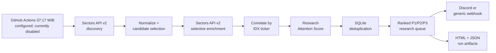

# MarketOps ID

**Autonomous IDX Research Triage**

[](https://github.com/respramon/marketops-id/actions/workflows/ci.yml)

MarketOps ID helps Indonesian equity research analysts stop manually scanning
disconnected market events. Its production workflow is configured for every
weekday at **07:17 WIB** and uses the **Sectors Financial API v2** to discover
IDX filings,
suspensions, and one-day movers; selectively enrich the strongest candidates
with news, foreign flow, and corporate actions; correlate evidence by ticker;
rank a research queue; suppress repeats; and deliver evidence-linked briefs.

> **Research triage only.** MarketOps ID does not provide BUY/SELL
> recommendations, target prices, trading signals, or trade execution.

> **Security status (28 August 2026): BLOCKED.** The scheduler and Discord
> delivery are temporarily disabled after generated Actions artifacts exposed
> the old webhook URL. The affected artifacts were deleted, the webhook was
> revoked, and the stale secret was removed. See
> [`SEC-001`](docs/security-audit.md#sec-001-discord-webhook-credential-disclosed-in-uploaded-workflow-logs)
> before operating or presenting the automation.

## The workflow



There is no click in a normal scheduled cycle. The dashboard is read-only: it
shows what the automation already produced and cannot trigger a run.

## Why Sectors is essential

Removing Sectors removes the product's discovery and evidence layers, so no
candidate universe or queue can be produced. MarketOps uses six verified v2
capabilities:

| Stage | Verified endpoint | Cost strategy |
| --- | --- | --- |
| Filings discovery | `GET /v2/filings/` | 1 credit |
| Suspension discovery | `GET /v2/suspensions/` | 1 credit |
| One-day movers | `GET /v2/companies/top-changes/` | Explicitly 2 classifications x 1 period = 2 credits |
| Candidate news | `GET /v2/news/` | One batched `symbols` call = 1 credit |
| Foreign-flow enrichment | `GET /v2/foreign-flow/{symbol}/` | At most 5 tickers |
| Corporate actions | `GET /v2/company/corporate-actions/{symbol}/` | At most 5 tickers |

The planned maximum is **15 credits per run**. The local credit ledger refuses
a call before it can exceed `MARKETOPS_MAX_API_CREDITS_PER_RUN`. Paginated list
sources use one 30-record page by default; if the API reports another page, the
run is visibly marked incomplete rather than silently treating the response as
the full result. See the
[verified API map](docs/sectors-api-map.md) for parameters, response fields,
billing, and official documentation links.

## Research Attention Score

The score orders human review; it does not estimate return or investment
quality. It is deterministic, order-independent, tested, and configured in
[`config/scoring.yml`](config/scoring.yml).

```text
Attention Score: 65/100 / P2 Review

+25 insider or major-shareholder filing
+10 significant ownership change
+20 large one-day price move
+10 relevant news
```

A suspension overrides the score to 100/P1. Other rules add filing,
transaction-size, price-move, foreign-flow-anomaly, relevant-news, and upcoming
corporate-action evidence, capped at 100. Every card exposes the exact point
breakdown and links to source evidence when the API provides a safe HTTP(S)
URL. The weights are **hackathon product heuristics**, not scientifically
validated investment factors.

## Run it locally

Requires Python 3.12.

```bash
python -m venv .venv
# Windows: .venv\Scripts\activate
# macOS/Linux: source .venv/bin/activate
python -m pip install -e ".[dev]"
```

No credential is needed for the deterministic replay:

```bash
marketops doctor
marketops run --mode fixture --dry-notify
marketops serve
# open http://127.0.0.1:8000
```

Fixture output is always marked:

> **SANITIZED HISTORICAL REPLAY - NOT LIVE MARKET DATA.**

For live data, copy `.env.example` to `.env`, place the real values only in
that ignored file, and run:

```bash
marketops doctor --check-api   # authenticated probe; costs 1 API credit
marketops run --mode live --dry-notify
marketops run --mode live
```

Required for live mode: `SECTORS_API_KEY`. Set `DISCORD_WEBHOOK_URL` or
`GENERIC_WEBHOOK_URL` for delivery. Secrets are wrapped as `SecretStr`, never
intentionally printed by application code, and must be stored as GitHub
Actions secrets in CI. The production `DISCORD_WEBHOOK_URL` secret is currently
absent by design during SEC-001 remediation; do not add its replacement until
the hardened workflow is committed and verified.

## Stateful deduplication and fail-soft behavior

Each normalized event receives a stable SHA-256 fingerprint from event type,
canonical symbol, WIB timestamp, and source/reference. SQLite atomically
claims new evidence, persists sent-alert audit rows, and stores run history,
status, score, timestamps, and estimated credits. A real successful delivery
is suppressed on the next replay; a webhook failure remains pending for a safe
retry. A dry-notify preview is never counted as an external delivery and does
not alter delivery state.

Source failures degrade the run to `PARTIAL`; they do not erase the remaining
queue. A briefing explicitly names missing evidence and never reports an
"all-clear" when discovery failed.

Discord delivery is split by both Discord's 10-embed count limit and its
6,000-character aggregate embed-text limit. A batch failure leaves every card
in that delivery attempt pending so the next real run can retry safely.

## Automation and Track 2 proof

[`marketops.yml`](.github/workflows/marketops.yml) contains both
`workflow_dispatch` for testing and a weekday cron at `00:17 UTC` (`07:17 WIB`).
Scheduled cycles use live mode, restore the prior SQLite state from a private
Actions cache, write a step summary, and upload logs plus HTML/JSON artifacts.
They never auto-commit runtime state.

The schedule is currently **disabled manually** as incident containment. It
must remain disabled until the secret-redacting logger and pre-upload artifact
scrub are committed, pushed, CI-verified, and a newly issued webhook passes a
clean replacement delivery test.

Two public `workflow_dispatch` fixture runs on 27 August 2026 verified the
same hosted-runner installation, artifact upload, and cache restore/save path:
[run one](https://github.com/respramon/marketops-id/actions/runs/33036266340)
observed 16 new events, while
[run two](https://github.com/respramon/marketops-id/actions/runs/33036310666)
restored state and suppressed all 16. These are engineering QA runs, not
scheduled-run proof.

Authenticated live QA was also completed through manual `workflow_dispatch`
runs. [Run `33039796607`](https://github.com/respramon/marketops-id/actions/runs/33039796607)
used all six Sectors capabilities, produced 77 normalized events and 33
candidates, selectively enriched five tickers, and stayed within the 15-credit
guard. It was `PARTIAL` only because the one-page news cap disclosed that more
records existed. An initial real Discord attempt exposed its aggregate
embed-text limit; commit `3f3bed7` added count-and-text-aware batching. The
[successful retry](https://github.com/respramon/marketops-id/actions/runs/33040201783)
historically delivered 16 research cards across three messages, and the
[immediate replay](https://github.com/respramon/marketops-id/actions/runs/33040251479)
suppressed 77 duplicate events and delivered zero notifications. These are
historical live integration and delivery facts, but all were manual runs and
are not presented as unattended schedule proof. A later audit found that
`httpx` INFO logging had copied the full Discord webhook URL into uploaded `workflow.log`
files for three delivery-related runs. Those affected artifacts were deleted;
only public run metadata/job pages remain. The historical counters are retained
for incident traceability, not as current downloadable delivery proof.

Track 2 qualification is not claimed from manual runs. Genuine scheduled-run
links, timestamps, screenshots, and artifact names belong in
[`evidence/unattended-runs.md`](evidence/unattended-runs.md); the project target
is at least three. Evidence collection cannot start until SEC-001 is remediated
and the scheduler is safely re-enabled. Until those rows are populated from
later GitHub Actions runs, that external evidence gate remains visibly blocked.

## Quality and security

```bash
ruff check .
mypy src
pytest --cov=marketops --cov-report=term-missing
```

Coverage fails below 80%. Tests cover scoring boundaries, event ordering,
normalization, persistent deduplication, all-success and partial-failure
pipelines, 429 retry, repeated 500, timeouts, malformed API responses,
notifications, CLI commands, and the read-only dashboard.

Local QA on 28 August 2026 passed Ruff, strict mypy across 14 source files, and
400 tests at 95.62% coverage. The latest public
[CI run for commit `3f3bed7`](https://github.com/respramon/marketops-id/actions/runs/33040157886)
predates the security remediation and passed 378 tests at 94.93% coverage plus
an installed-wheel smoke test. A new public CI result is still required. The
wheel gate protects packaged
configuration, fixtures, templates, and static assets from deployment-only
regressions.

Security controls include environment-only secrets, an HTTPS-only Sectors API
target,
safe HTTP(S) provenance links, Jinja auto-escaping, a strict script-free CSP,
Host validation, security headers, parameterized SQLite, pinned direct
dependencies plus `uv.lock`, SHA-pinned GitHub Actions, and no browser-side
secret storage. SEC-001 demonstrated that repository scans and application
exception hygiene were insufficient when an HTTP library logged a
secret-bearing URL into a generated artifact. The pending two-layer
remediation redacts final log lines, quiets HTTP transport logs, and
scrubs/fails artifacts before upload. The security audit stays BLOCKED until
that fix and a clean replacement run are verified. Full details are in
[`docs/security-audit.md`](docs/security-audit.md).

## Repository guide

- `src/marketops/` - typed client, normalization, scoring, state, pipeline,
  notification, rendering, CLI, and FastAPI dashboard
- `fixtures/sanitized/` - deterministic Sectors-v2-shaped historical replay
- `tests/` - unit and mocked-HTTP integration suite
- `.github/workflows/` - CI and production scheduler
- `docs/` - architecture, decisions, official-rule verification, API map, and
  execution status
- `evidence/` - unattended-run proof pack
- `submission/` - final copy, storyboard, scripts, captions, and visual assets

Official compliance was rechecked on 27 August 2026; see
[`docs/rules-verification.md`](docs/rules-verification.md). Submission freezes
the repository immediately, so rules, tests, links, secrets, and evidence must
all be verified before the portal is submitted.

MIT licensed. Market data is provided by Sectors and remains subject to its
terms and source provenance.
