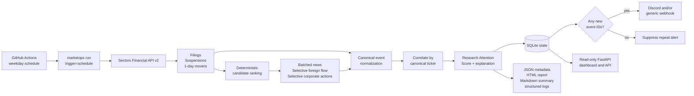
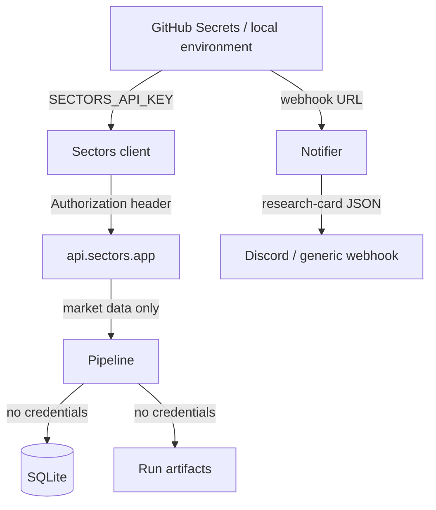

# MarketOps ID Architecture

MarketOps ID is an unattended research-triage pipeline for an Indonesian equity
research analyst or small research desk. It discovers market events through the
Sectors Financial API v2, joins evidence by IDX ticker, assigns a deterministic
Research Attention Score, suppresses already-seen events, and delivers only new,
prioritized research cards. It does not recommend, predict, price, or trade a
security.

> Research triage only. MarketOps ID does not provide investment
> recommendations or execute trades.

## System Context



Sectors is the product's core data dependency. Removing Sectors removes the
filings, suspensions, mover discovery, news, foreign-flow history, corporate
actions, source provenance, candidate universe, and therefore the research
queue itself. Sanitized fixtures mirror verified Sectors response shapes only
to make development and judging replay deterministic without spending credits.

## End-to-End Run

1. When GitHub Actions is enabled for the pushed repository, its weekday
   schedule is configured to start `marketops run --mode live --trigger
   schedule`. A manual trigger exists for diagnosis, but is not the Track 2
   proof. No genuine scheduled execution is documented yet; see
   [`../evidence/unattended-runs.md`](../evidence/unattended-runs.md).
2. The typed HTTP client performs broad discovery over a configured lookback:
   filings, suspensions, and the top gainers and losers for the `1d` period.
3. Raw records cross a normalization boundary. Symbols become bare uppercase
   tickers, timestamps become timezone-aware WIB values, nullable links remain
   nullable, and malformed rows are skipped and counted.
4. Discovery events are ranked deterministically. Suspensions and material
   filings rank ahead of ordinary price movement. Muted tickers are excluded.
5. News is fetched in a batched symbol request. Foreign flow and corporate
   actions are fetched per symbol for at most
   `MARKETOPS_MAX_ENRICH_TICKERS` candidates (default five). A suspension that
   already pins the score at 100 skips paid per-symbol enrichment.
6. Evidence is grouped by canonical ticker. The configured scoring engine
   calculates one score and an ordered list of contributing reasons.
7. SQLite atomically claims normalized event fingerprints, so two overlapping
   processes cannot both call the same evidence new. Dossiers are still shown
   on replay, while real delivery is eligible only for evidence that has not
   reached a sink.
8. Evidence is claimed before notification and successful real delivery is
   separately recorded in the `alerts` table. A failed webhook therefore leaves
   the card pending for a safe retry rather than losing it to deduplication.
9. The run, source health, warnings, estimated credits, queue, and timestamps
   are persisted. JSON, standalone HTML, Markdown, and run-history artifacts
   are written for CI retention and audit.
10. The dashboard reads the latest persisted run. It has no route that can
    start or mutate the pipeline.

## Components

| Component | Responsibility |
|---|---|
| `marketops.cli` | `doctor`, `run`, `report`, `serve`, exit codes, structured-log mode |
| `marketops.sectors` | Authenticated API v2 requests, timeout/retry behavior, response-cost accounting, pre-call budget guard, fixture adapter |
| `marketops.normalize` | Defensive mapping from six raw API shapes into `MarketEvent` |
| `marketops.correlate` | Candidate ordering, ticker grouping, dossier construction, stable evidence ordering |
| `marketops.scoring` | Config-driven score, priority bands, explanations, suspension override |
| `marketops.state` | SQLite schema, event partitioning, run history, delivery audit |
| `marketops.pipeline` | Discovery, selective enrichment, fail-soft orchestration, verdict generation |
| `marketops.notify` | Discord embeds, generic JSON payloads, dry-run preview, safe webhook errors |
| `marketops.render` | Standalone HTML, JSON, Markdown, and terminal summaries |
| `marketops.web` | Read-only dashboard plus `/api/latest`, `/api/runs`, and `/healthz` |

## Sectors API Surface

Only endpoints verified in the official v2 documentation are called. Exact
parameters, response fields, costs, and failure semantics are recorded in
[`sectors-api-map.md`](sectors-api-map.md).

| Stage | Capability | Exact path | Planned successful-call cost |
|---|---|---|---:|
| Discovery | Filings | `GET /v2/filings/` | 1 |
| Discovery | Suspensions | `GET /v2/suspensions/` | 1 |
| Discovery | Movers, two classifications x `1d` | `GET /v2/companies/top-changes/` | 2 |
| Enrichment | Batched news | `GET /v2/news/` | 1 |
| Enrichment | Foreign flow | `GET /v2/foreign-flow/{symbol}/` | 1 per selected ticker |
| Enrichment | Corporate actions | `GET /v2/company/corporate-actions/{symbol}/` | 1 per selected ticker |

With five payable candidates, the planned path estimates 15 credits. The
runtime default hard ceiling is 15 credits, configurable with
`MARKETOPS_MAX_API_CREDITS_PER_RUN`. The ledger checks affordability before a
request is sent. Fixture mode makes no network request and spends no real
credit; it simulates the equivalent live cost to test the same guard.

## Canonical Event and Deduplication

Every normalized event contains:

- `event_type`
- canonical `symbol`
- timezone-aware `occurred_at`
- human-readable headline and detail
- `source_ref` and optional `source_url`
- the defensively preserved fields needed for scoring and audit

Its identity is:

```text
SHA256(event_type | symbol | occurred_at-in-WIB | source_ref)
```

The fingerprint is independent of run ID, input ordering, and wall-clock time.
SQLite uses it as the `events.event_id` primary key, so a restarted process
recognizes the same filing or mover event. A changed timestamp or source
reference remains an independent event.

## Research Attention Score

The score is a transparent queue-ordering heuristic configured in
`config/scoring.yml`. It is not a security rating or expected-return model.

- Suspension: override to 100.
- Filing: base points, with ownership-change and transaction-value additions.
- Price move: one exclusive magnitude tier.
- Foreign flow: one exclusive anomaly tier calculated from prior observations.
- News: presence of relevant ticker-linked news.
- Corporate action: a parseable upcoming event within the configured window.
- Watchlist: a small desk-coverage bonus only when other score evidence exists.

The total is capped at 100 and mapped to P1/P2/P3 thresholds. Aggregation uses
`max` and presence checks over the evidence set, so event ordering cannot alter
the result. Every component is shown with points and supporting evidence.

## State Model

SQLite is intentionally small and operationally simple:

| Table | Purpose |
|---|---|
| `events` | One row per first-seen deterministic event ID |
| `alerts` | Successful non-dry-run delivery audit by run, ticker, priority, score, channel, and event IDs |
| `runs` | Counters and the complete serialized `RunReport` for each execution |
| `schema_meta` | Database schema version |

WAL mode and transactions protect local writes. The production workflow must
restore the previous database before a run and save the updated database after
the run; otherwise an ephemeral CI runner cannot deduplicate across days. Run
artifacts are evidence and diagnostics, not the deduplication source of truth.

## Reliability and Failure Semantics

- HTTP timeout defaults to 15 seconds.
- Retryable transport failures, HTTP 429, and HTTP 5xx use bounded exponential
  backoff with full jitter; `Retry-After` is honored up to 30 seconds.
- HTTP 400, 401, 403, and 404 are terminal and mapped to explicit exceptions.
- One failed source or ticker does not discard usable evidence from the others.
- A degraded run is `PARTIAL` and names the unavailable or incomplete source.
- If all three discovery sources are unavailable or budget-stopped before
  returning usable evidence, the run is `FAILED` and explicitly says that the
  result is not an all-clear.
- Paginated discovery and news responses validate the documented envelope.
  The production default reads one maximum-size page (30 rows); if another page
  exists, the source reports a visible gap and the run becomes `PARTIAL` rather
  than silently implying complete coverage.
- Notification failure makes an otherwise healthy run `PARTIAL`; it never
  prints a webhook URL or API key.
- A malformed source record is skipped, counted, and disclosed in warnings.

## Trust Boundaries and Secrets



Secrets are represented as Pydantic `SecretStr`, loaded from environment
variables, omitted from output, and ignored by Git. Source URLs and market data
are treated as untrusted display content; Jinja auto-escaping remains enabled.
The dashboard is a local/read-only evidence viewer, not a multi-user service.

## Fixture and Live Data Boundary

All files under `fixtures/sanitized/` are labeled:

```text
SANITIZED HISTORICAL REPLAY - NOT LIVE MARKET DATA
Used for deterministic testing and demo.
```

Ticker symbols are real IDX symbols, but fixture figures and example-news URLs
are synthetic. Every fixture artifact has `mode: fixture` and a visible replay
banner. Only an authenticated `mode: live` scheduled run can be presented as
current market monitoring.

## Known Scope Boundaries

- The client supports documented offset pagination when a caller explicitly
  requests more than 30 records. The scheduled default deliberately reads one
  30-record page per list endpoint to protect the 15-credit budget; a
  `has_next` response is disclosed as incomplete evidence.
- It is a single-team, single-state workflow without user authentication.
- SQLite CI durability depends on correctly configured workflow persistence.
- Webhooks provide delivery, not acknowledgment or escalation tracking.
- `max_concurrency` is configurable for future expansion; the current client
  issues calls sequentially for deterministic budget and retry behavior.
- No brokerage integration, order path, target price, buy/sell output, or LLM
  investment judgment exists by design.
